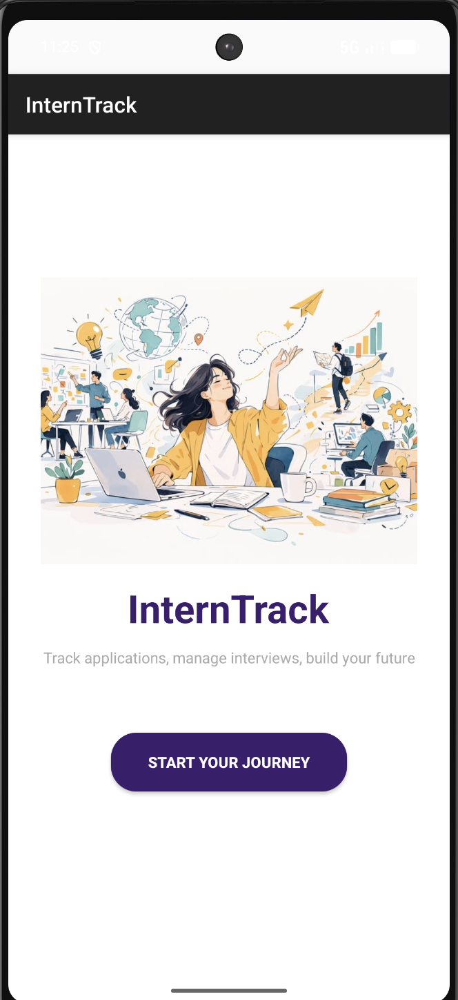
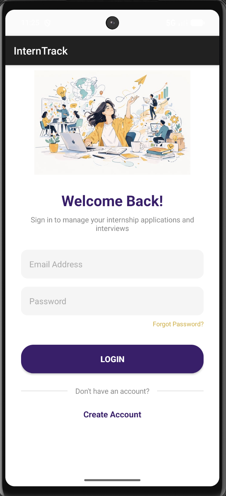
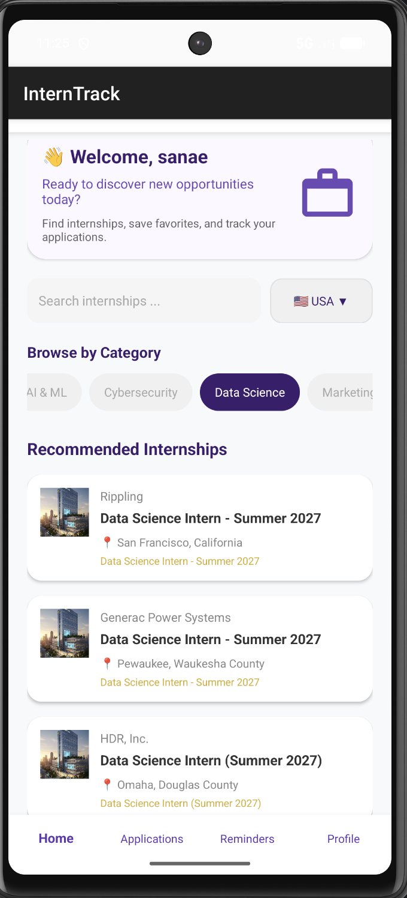
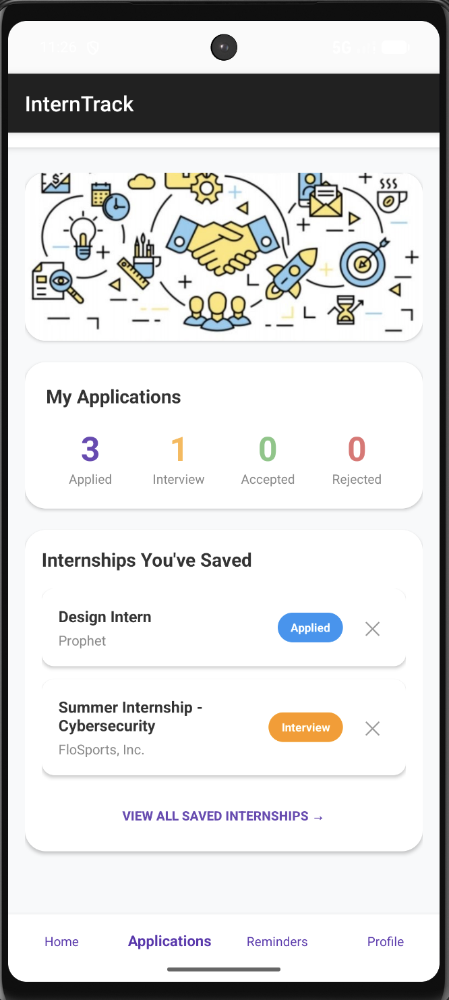
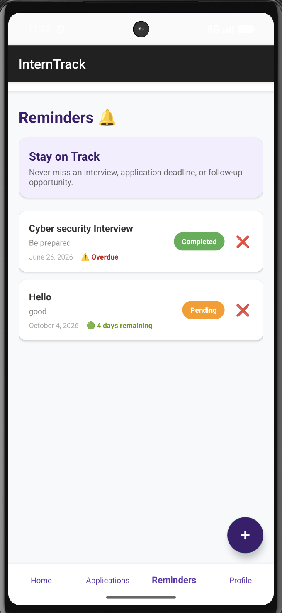
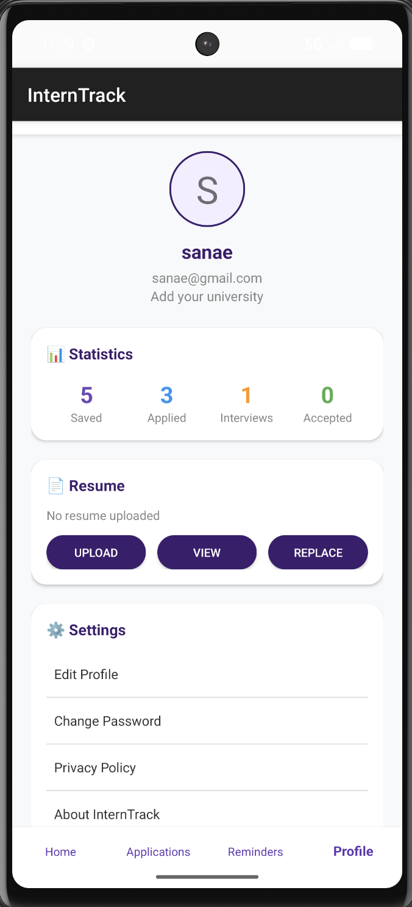

# InternTrack 📱

InternTrack is an Android internship management application designed to help students discover internship opportunities, save and manage applications, set reminders, and track their internship progress in one place.

## Project Overview

InternTrack provides students with a simple way to search for internship opportunities and organize their application journey.

The application retrieves internship opportunities using the **Adzuna API** and allows users to filter opportunities by category, country, and search keywords.

Users can also manage saved internships, track application statuses, create reminders, manage their profile, and upload their CV.

## Features

### 🔐 Authentication
- User registration
- User login
- Local user data management

### 🔎 Internship Search
- Browse internship opportunities
- Search by keywords
- Filter by internship category
- Filter by country
- View internship details
- Access the application URL

### 📌 Application Management
Users can save internships and track their application status:

- Interested
- Applied
- Interview
- Rejected
- Accepted

### ⏰ Reminders
- Create internship-related reminders
- Select a reminder date
- Add notes
- View countdowns
- Track reminder status
- Mark reminders as Completed or Pending

### 👤 Profile Management
Users can:

- Edit their name
- Edit their university
- Edit their major
- Change their password
- Upload a CV in PDF format
- View their CV
- Replace their CV
- View application statistics
- Log out

### 📊 Application Statistics
The profile section provides statistics for:

- Saved
- Applied
- Interview
- Accepted

## App Sections

### 🏠 Home
The Home section provides access to internship opportunities with:

- Internship categories
- Country filtering
- Keyword search
- Internship cards
- Internship details

### 📋 Applications
The Applications section allows users to manage saved internships and track their application status.

### ⏰ Reminders
The Reminders section allows users to create and manage internship-related reminders with countdowns and status tracking.

### 👤 Profile
The Profile section provides personal information management, CV management, application statistics, password management, and logout.

## Screenshots
### 🚀 Splash Screen

### 🔐 Login

### 🏠 Home

### 📋 Applications

### ⏰ Reminders

### 👤 Profile

## Technologies

- **Kotlin** — Main programming language
- **XML** — User interface layouts
- **Android Studio** — Development environment
- **Adzuna API** — Internship opportunity data
- **Gson** — Data serialization and deserialization
- **SharedPreferences** — Local data storage
- **Android Activities & Fragments** — Application architecture
- **Intent** — Navigation between screens
- **DatePickerDialog** — Reminder date selection
- **AlertDialog** — Dialog interactions
- **ExecutorService & Threading** — Background API operations
- **Dynamic Views & LinearLayout** — Dynamic internship and application lists

## Project Structure

```text
InternTrack/
├── app/
│   └── src/
│       └── main/
│           ├── java/
│           │   └── com/example/interntrack/
│           │       ├── ApplicationsFragment.kt
│           │       ├── HomeFragment.kt
│           │       ├── Homeactivity.kt
│           │       ├── InternshipDetailsActivity.kt
│           │       ├── LoginActivity.kt
│           │       ├── ProfileFragment.kt
│           │       ├── RegisterActivity.kt
│           │       ├── RemindersFragment.kt
│           │       ├── SavedApplicationsActivity.kt
│           │       └── SplashActivity.kt
│           │
│           ├── res/
│           │   ├── drawable/
│           │   ├── layout/
│           │   ├── menu/
│           │   ├── mipmap/
│           │   ├── values/
│           │   └── xml/
│           │
│           └── AndroidManifest.xml
│
├── gradle/
├── build.gradle.kts
├── settings.gradle.kts
├── gradle.properties
├── gradlew
└── gradlew.bat